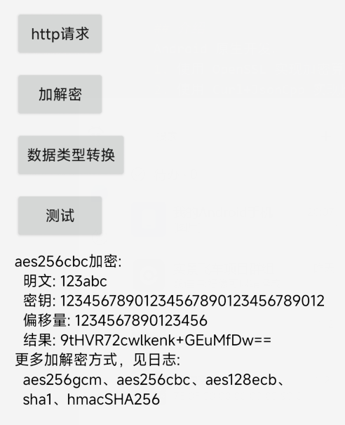

# AndroidNative

## 介绍
Android 原生开发。
1. 使用 OpenSSL 实现加密算法。
2. 使用 Curl+JsonCpp 实现http请求。

## 使用 OpenSSL 实现加密算法
1. 加密算法包括 
aes_256_gcm、aes_256_cbc、aes_128_ecb、SHA-1、HMAC算法。
2. 实现原理见博客
https://yadiq.github.io/2024/07/03/AndroidOpensslEncrypt/

## 使用 Curl+JsonCpp 实现http请求
1. 功能 
使用JsonCpp实现Json转string 和 string转Json
使用curl实现 http get请求 和 post请求。
2. 实现原理见博客
https://yadiq.github.io/2024/07/04/AndroidCurlHttp/

## 效果图

